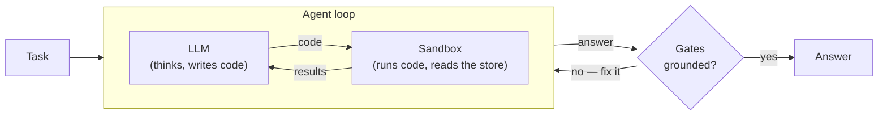
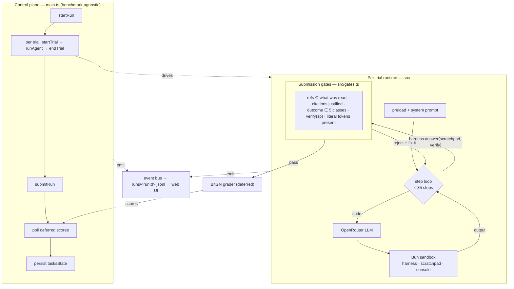

# ecom-agent

A TypeScript / Bun agent that runs the [BitGN](https://bitgn.com) **ECOM** benchmark. It connects to the BitGN harness, runs each trial through an LLM (via [OpenRouter](https://openrouter.ai)) that drives a per-trial JavaScript sandbox, then submits the run and fetches scores.

Every event (steps, reasoning, scratchpad state, system prompt, grader detail) is written to `runs/<runId>.jsonl`. A web UI (refresh-only — no SSE) browses the current run and every past one in the same view.

## Architecture

One model. One tool. A loop that won't let it submit ungrounded.



The model drives a JavaScript sandbox through a single `execute_script` tool: it
writes code, the code reads the e-commerce store, results come back, repeat. When it
tries to answer, deterministic **gates** reject anything that isn't grounded in data
it actually read — and hand back a fix-it message so it can retry.

<details>
<summary>Full system view (control plane, runtime, gates, logging)</summary>



Two Connect-RPC surfaces: a benchmark-agnostic **control plane** ([main.ts](main.ts))
owning the run lifecycle, and a per-trial **runtime** ([src/](src/)) where the agent
loop runs. Gate order and details: [src/gates.ts](src/gates.ts). Every event is
mirrored to `runs/<runId>.jsonl`.

</details>

## Results

Top-20 on the **`bitgn/ecom1-prod`** blind leaderboard ([run-22RxPyYQ4dtnsaeKdXpRsJ6ce](https://eu.bitgn.com/runs/run-22RxPyYQ4dtnsaeKdXpRsJ6ce)) with a **single open-weight model** (`xiaomi/mimo-v2.5-pro`) and a **single `execute_script` tool** — no planner, router, or judge. The leaderboard config is the default in [.env.example](.env.example) (`REASONING_EFFORT=low`, citation gates on). Architecture write-up: [docs/insights-submission/](docs/insights-submission/).

## Requirements

- [Bun](https://bun.sh) `>= 1.1`
- An **OpenRouter** API key — <https://openrouter.ai/keys>
- A **BitGN** API key for the official benchmark — <https://bitgn.com>

## Setup

```sh
git clone <this-repo> ecom-agent
cd ecom-agent
bun install
cp .env.example .env
# fill in OPENROUTER_API_KEY and BITGN_API_KEY
```

## Run

Full benchmark (runs every task where `tasksState.ts:enabled !== false`):

```sh
bun run start
```

A subset of tasks (positional task ids override the enabled filter):

```sh
bun run main.ts t13 t38
```

Web UI: <http://localhost:3000> while a run is going (set `WEB_PORT=0` to disable). The UI is **refresh-only** — click ↻ Refresh to pull the latest snapshot. No auto-polling, no SSE, no flicker. The same UI also lists every past run (Runs tab) so you can replay them turn-by-turn — code, output, reasoning, scratchpad state per step.

To browse past runs without starting a new benchmark:

```sh
bun run scripts/web.ts          # boots the web UI standalone on $WEB_PORT (default 3000)
```

## Tests

```sh
bun test          # unit + mocked-integration suite — no network, no API keys
bun run typecheck # tsc --noEmit
```

The suite covers the pure logic (gates, parsing, formatting, config), the harness factory, and the full `runAgent` loop driven against an injected fake `vm` + scripted `llm` (see [src/test-helpers.ts](src/test-helpers.ts)). The system prompt is hash-locked by [src/prompt.test.ts](src/prompt.test.ts) — if you edit the prompt, update its expected hash in the same commit. End-to-end validation still happens by running against the BitGN harness.

When the run finishes you'll see per-task scores, the grader's per-trial detail (e.g. `answer missing required reference '/proc/catalog/X.json'`), and a final percentage. The full event log is saved to `runs/<runId>.jsonl`.

### Signal handling

Hit `Ctrl-C` once and the run is force-submitted (in-flight trials forfeit, completed ones keep their scores). Hit it twice for a hard exit. The runId is printed so you can recover scores later:

```sh
bun run finalizeRun.ts <runId>   # read-only; pulls scores via getRun and updates tasksState.ts
```

`finalizeRun.ts` is also the right tool to inspect a still-running benchmark — it never submits, only reads.

## Environment variables

| Variable | Default | Notes |
|---|---|---|
| `OPENROUTER_API_KEY` | — | **Required.** Used to call OpenRouter. |
| `BITGN_API_KEY` | — | **Required** for `bitgn/ecom1-dev`. |
| `MODEL_ID` | `z-ai/glm-5.1` | Any model id supported by OpenRouter. `.env.example` ships the leaderboard champion `xiaomi/mimo-v2.5-pro` (single open-weight model, no planner/router/judge). |
| `BENCH_ID` / `BENCHMARK_ID` | `bitgn/ecom1-dev` | Override the benchmark. |
| `BITGN_HOST` / `BENCHMARK_HOST` | `https://api.bitgn.com` | Override the harness endpoint. |
| `MAX_TASKS` | (no cap) | Stop after this many *enabled* tasks have run. Skipped tasks still get cleanly closed. |
| `CONCURRENCY` | `1` | Parallel trial slots. 3–5 is a good range; high values invite OpenRouter throttling. |
| `HINT` | — | Appended to the system prompt after `hints/system.md`. |
| `OPENROUTER_TIMEOUT_MS` | `90000` | Per-request timeout. Retried on 408/425/429/5xx with exponential backoff. |
| `SCORE_POLL_TIMEOUT_MS` | `300000` | Max time to poll `getRun` for deferred scores after submission. |
| `REASONING_EFFORT` | `medium` | OpenRouter `reasoning.effort` passed on agent calls (`low` / `medium` / `high` / `off`). Silently ignored by non-reasoning models. The champion run used `low`, which outscored `medium` on dev. |
| `WEB_PORT` | `3000` | `0` to disable the web UI. |
| `FEAT_*` flags | `false` | Experimental harness behavior flags, parsed in [src/config.ts](src/config.ts). Canonical names: `FEAT_LAZY_MD`, `FEAT_AUTO_CITE`, `FEAT_STRICT_REFS`, `FEAT_CITING_REASONING`, `FEAT_STRUCTURED_FACTS`, `FEAT_REFS_WHY_CANONICAL`, `FEAT_DEBUG_REF_PROBE`, `FEAT_NAV_HINTS`. `CITING_REASONING` and `STRUCTURED_FACTS` are accepted as back-compat aliases. "On" = `true`/`1`/`on`/`yes`. See [docs/FEATURES.md](docs/FEATURES.md). |

## tasksState.ts

Per-task control file. Flip `enabled: false` to skip a task on the next run without losing its history. New tasks (e.g. when BitGN adds `t54`) default to `enabled: true` on first sight.

```ts
{
  t13: { enabled: true,  lastScore: 0,   lastRunAt: "...", runs: 3, sumScore: 0.5 },
  t34: { enabled: false, lastScore: 1,   lastRunAt: "...", runs: 1, sumScore: 1 },
}
```

`sumScore / runs` gives the true average across all runs (preserves partial credit from fraud tasks etc.). The writer updates this file in place after every scored trial.

## Project layout

- [main.ts](main.ts) — control plane: BitGN harness, run lifecycle, concurrency, score polling (with grader detail capture via `getTrial`), signal handlers.
- [src/](src/) — the per-trial runtime, decomposed into focused, individually-tested modules (the former monolithic `agent.ts`):
  - [src/loop.ts](src/loop.ts) — `runAgent`: the per-trial reasoning loop, no-answer gate, `scratchpad.cite` injection. Accepts an optional `deps` object (`{ config, llm, makeVm, emit }`) defaulting to production — the seam the tests inject through.
  - [src/config.ts](src/config.ts) — typed `Config`/`Features` from env. **Single source of truth for feature flags.**
  - [src/gates.ts](src/gates.ts) — the submission gates as pure functions (`runSubmissionGates`).
  - [src/harness.ts](src/harness.ts) — typed wrapper/factory over the `EcomRuntime` RPC.
  - [src/openrouter.ts](src/openrouter.ts) — typed OpenRouter client + retry/backoff.
  - [src/prompt.ts](src/prompt.ts) — system-prompt builder (locked by `src/prompt.test.ts`).
  - [src/preload.ts](src/preload.ts), [src/sandbox.ts](src/sandbox.ts), [src/parse.ts](src/parse.ts), [src/format.ts](src/format.ts), [src/types.ts](src/types.ts), [src/cli.ts](src/cli.ts), [src/util.ts](src/util.ts) — preload, JS sandbox, and leaf helpers.
- [tasksState.ts](tasksState.ts) — per-task `enabled` flags and history.
- [tasksStateIO.ts](tasksStateIO.ts) — atomic load/update/persist for `tasksState.ts`.
- [finalizeRun.ts](finalizeRun.ts) — standalone script to fetch scores for a given runId (read-only).
- [web.ts](web.ts) — Bun HTTP server + refresh-only UI for live + past runs.
- [events.ts](events.ts) — in-process event bus + typed event union.
- [logs.ts](logs.ts) — writes `runs/<runId>.jsonl`; loads `hints/system.md`.
- [hints/system.md](hints/system.md) — extra system-prompt content loaded on every run.
- [scripts/web.ts](scripts/web.ts) — standalone web viewer (no trials).
- [scripts/run-experiment.ts](scripts/run-experiment.ts) — flag-bisection orchestrator with per-config aggregation, rate-limit-aware spacing, and markdown reporting.
- [scripts/test-reasoning.ts](scripts/test-reasoning.ts) — probes OpenRouter to confirm the model actually returns `message.reasoning` for the configured effort.

### What gets logged per run

Every line of `runs/<runId>.jsonl` is one typed event. The interesting fields:

- `run:start` → `envFlags` (every `FEAT_*`, `REASONING_EFFORT`, etc. at startup — no more guessing what was active).
- `bootstrap` with `tool="system_prompt"` and `tool="initial_scratchpad"` → the **full** system prompt and the prepopulated scratchpad for that trial.
- `step` → `code`, `output`, `reasoning` (full text), `reasoningTokens`, `completionTokens`, `promptTokens`, `scratchpadAfter` (deep snapshot of scratchpad after the script ran).
- `trial:score` → `score` and `scoreDetail` (the grader's exact reason, e.g. `answer contains invalid reference '/proc/catalog/X.json'`).

## Troubleshooting

- **`OPENROUTER_API_KEY is required`** — set it in `.env`.
- **`OpenRouter 404: No endpoints available matching your guardrail restrictions`** — the `MODEL_ID` isn't routable under your OpenRouter account's provider/guardrail settings. The request body in [src/openrouter.ts](src/openrouter.ts) sends no `provider` pin, so this is account-side: switch `MODEL_ID` to a model your account can reach, or adjust your OpenRouter routing preferences.
- **`unauthenticated` from `startRun`** — set `BITGN_API_KEY`; `bitgn/ecom1-dev` requires it.
- **`run has unfinished trials`** — automatic backstop: the submitter retries with `force: true` and forfeits the orphans. Should not bubble to the user.
- **Score `not available` at trial end** — expected. Scoring is deferred; `batchFetchScores` polls `getRun` after submission.
- **`@buf/...` install fails** — make sure the `.npmrc` is present; it points the `@buf` scope at `https://buf.build/gen/npm/v1/`.

## License

See repository for license information.
