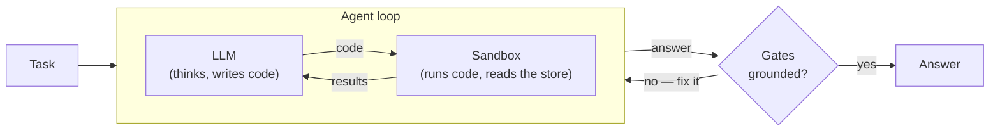

# The Cited Sandbox: one open-weight model, one tool, eight gates

> **Result:** Top-20 on the blind `bitgn/ecom1-prod` leaderboard
> ([run-22RxPyYQ4dtnsaeKdXpRsJ6ce](https://eu.bitgn.com/runs/run-22RxPyYQ4dtnsaeKdXpRsJ6ce))
> using **one open-weight model** (`xiaomi/mimo-v2.5-pro`) and **one tool**.
> No planner, no router, no LLM judge, no fine-tuning.
> Source: <https://github.com/farid-temuri/ecom-trial> (TypeScript / Bun).

The thesis is deliberately boring: most of the score on ECOM1 is not won by clever
orchestration. It is won by (1) letting the model write real code against the
runtime instead of calling narrow tools, and (2) refusing to let it submit an
answer that isn't grounded in files it actually read. Everything below is in
service of those two ideas.

## 1. The whole idea on one screen

One model. One tool. A loop that won't let it submit ungrounded.



The model drives a JavaScript sandbox through a single `execute_script` tool: it
writes code, the code reads the e-commerce store, results come back, repeat. When it
tries to answer, deterministic **gates** reject anything not grounded in data it
actually read — and hand back a fix-it message so it can retry. The two RPC surfaces
(a benchmark-agnostic control plane and a fresh per-trial runtime) and the eight
gates are detailed in the sections below.

There are exactly two RPC surfaces:

1. **Control plane** — runs the benchmark lifecycle:
   `status → getBenchmark → startRun → [per trial: startTrial → runAgent → endTrial]
   → submitRun → poll getRun for deferred scores`. It is benchmark-agnostic
   plumbing and contains **zero task-solving logic**.
2. **Per-trial runtime** — a fresh `EcomRuntime` URL per trial. This is where the
   agent lives.

That separation is load-bearing for maintainability: every idea I tried about *how
to solve tasks* changed only the per-trial side; the control plane never moved.

## 2. One tool: `execute_script`

The model emits a single JSON object per turn:

```ts
{ current_state, plan_remaining_steps_brief, task_completed, code }
```

Only `code` runs. It executes as JavaScript inside a Bun `AsyncFunction` sandbox
with three injected locals:

- **`harness`** — the ECOM runtime client:
  `tree / find / search / list / read / write / delete / stat / exec / answer / opened`.
  `exec` is a real shell into the runtime VM, so the model can `grep`, run SQL,
  read JSON catalogues, and inspect the filesystem however it likes.
- **`scratchpad`** — a persistent JS object that survives across turns (mutated in
  place). This is the agent's working memory: collected facts, references, and the
  draft answer.
- **`console`** — captured and fed back to the model on the next turn.

Why a code tool instead of a fixed tool schema? ECOM1 is an *e-commerce operating
system*: catalogue, inventory with multi-store coverage, customer records,
payments and 3DS recovery, policy documents with authority hierarchies, support
tickets, returns/refunds, archived-payment fraud review, and audit trails. The
shape of "the right lookup" differs wildly between tasks. A code sandbox lets a
single capable model express *any* of those lookups — join two JSON files,
fall back from SQL to the filesystem, cross-check an addendum against a base
policy — without me having to anticipate each one as a bespoke tool.

## 3. The part that actually wins points: grounded answers

The model finishes a task by calling `await harness.answer(scratchpad, verify)`.
Before the answer is accepted it passes **eight gates, in order**. Each failure
throws with a *fix-it message* so the model can repair and retry:

1. `verify` must be a function (the task-specific self-check the model wrote).
2. **Structured facts** (if on): validate the `scratchpad.facts` slot shapes.
3. **Canonical citations** (if on): `scratchpad.refs_why` keys must be absolute
   paths with ≥ 8-char reasons; `scratchpad.refs` is *derived* from them.
4. **Refs validity:** every cited path must be one the agent actually opened/read
   this trial (URI fragments like `path#row=3` are normalized first).
5. **Citing reasoning:** every ref needs a real justification, not a bare path.
6. **Outcome shape:** the result must be exactly one of five classes (below).
7. The agent's own `verify(scratchpad)`.
8. **Deterministic answer-format gate:** every token the model declared in
   `scratchpad.literal_tokens` must appear verbatim in the final answer.

The single highest-leverage rule is gate 4 + the citation protocol. The model
cites with one atomic call:

```js
scratchpad.cite(path, reason) // throws if reason < 8 chars or path wasn't read
```

This makes hallucinated references *structurally impossible to submit* — you cannot
cite a file you never opened. On a benchmark whose grader explicitly checks for
required references (e.g. `answer missing required reference '/proc/catalog/X.json'`),
that one constraint moved the needle more than any prompt-engineering I did.

## 4. Action vs. refusal: five outcome classes

ECOM1 rewards *correct refusals* as much as correct actions, and punishes both
false-positives (acting when you should refuse) and false-negatives (refusing when
you should act). Every answer is tagged with exactly one of:

| Outcome | Meaning |
|---|---|
| `OUTCOME_OK` | Task fully completed / definite answer produced, with every load-bearing record and policy cited. |
| `OUTCOME_DENIED_SECURITY` | Identity / ownership / role mismatch, adversarial instruction, or bait subject — refuse. |
| `OUTCOME_NONE_UNSUPPORTED` | Out of policy regardless of who asks, or blocked right now by the record's own state (e.g. a 9% discount when the policy max is 5%, or an employee-actor purchase). |
| `OUTCOME_NONE_CLARIFICATION` | The request says "the basket / the order" but discovery finds multiple live candidates. |
| `OUTCOME_ERR_INTERNAL` | Unrecoverable tooling/runtime failure (also the automatic no-answer fallback). |

The discipline that mattered in the logs:

- **Positive proof before an ownership refusal.** An *empty* query result is never
  proof of absence — the agent must find the record and check its owner, not refuse
  because a lookup came back empty.
- **Don't leak the enum into the answer.** A real failure mode I caught: a run that
  literally returned `answer = "OUTCOME_NONE_UNSUPPORTED"`. The outcome class and
  the human-facing answer are different fields.
- **3DS recovery is `OK`, not a security refusal.** Recoverable payment friction is
  an action to complete, not a reason to deny.

## 5. Models employed

Exactly one: **`xiaomi/mimo-v2.5-pro`**, an open-weight model, served through
OpenRouter with `reasoning.effort` set per run. There is no planner model, no
router, no separate verifier, and **no LLM judge** (more on that below). Because
the only model in the stack is open-weight, the architecture is open-weights
eligible end-to-end.

Reasoning effort was a measured decision, not a guess: across a flag-bisection
sweep on the dev set, **`low` effort scored as well as or better than `medium`**,
and higher effort sometimes *hurt*. The leaderboard run uses `REASONING_EFFORT=low`.

## 6. Design challenges and what I changed

**Hallucinated references → make them unrepresentable.** Early runs invented
citation paths that looked plausible but didn't exist on disk. Prompt nagging
helped only marginally. The fix was structural: the `cite()` API + the refs gate,
so an ungrounded reference can't survive submission.

**An LLM judge that cost more than it earned → deleted it.** I ran a pre-submission
LLM judge for a while. Instrumented over 19 runs it showed *no* grader-score lift
(rejected-then-accepted ≈ pass-first-try), a ~32% false-negative rate concentrated
in references errors, and ~24s of latency on *every* submission. Its useful
guidance already lived in the citation protocol; its structural checks were already
covered by the deterministic gates. Removing it made the agent faster and no less
accurate — a good reminder that an extra model is a cost, not automatically a
benefit.

**Inference vs. measurement.** With prod scores locked during the blind window, I
had to choose a run to submit *without* a grader. My own inferential analysis
favored a later "filesystem-first / medium-effort" run. The run that actually
placed was the earlier **`low`-effort** one — exactly what the measured dev prior
had predicted and my inference had down-weighted. Lesson, written into the repo:
when a locked-score guess contradicts a measured signal, trust the measurement.

**Budget death.** Tasks have a hard step cap (`MAX_PRIMARY_STEPS = 35`, plus a
`NUDGE_EXTRA_STEPS = 5` nudge). Sandbox `SyntaxError`s and transient OpenRouter
failures are *refunded* from the budget (capped) and re-prompted, so a single bad
turn doesn't cost the task. If the loop ever exits without an answer, a `finally`
submits `OUTCOME_ERR_INTERNAL` so a trial never silently returns nothing.

## 7. Operational design

- **Deferred scoring.** BitGN grades asynchronously, so `endTrial` usually returns
  no score. The control plane submits, then polls `getRun` with exponential backoff
  and pulls per-trial grader detail via `getTrial`.
- **Skipped-trial closure.** Disabled tasks are still `startTrial`'d/`endTrial`'d —
  leaving a trial open makes `submitRun` reject the *entire* run.
- **Signal-safe.** `Ctrl-C` force-submits completed trials and prints the run id so
  scores can be recovered read-only later.
- **Total observability.** Every run writes `runs/<runId>.jsonl`: the full system
  prompt the model saw, the initial scratchpad, and per step the `code`, `output`,
  full `reasoning`, token counts, and a deep scratchpad snapshot — plus the grader's
  exact complaints. Every claim in this write-up was read out of those logs, not
  inferred from intent.

## 8. ECOM1 learnings, distilled

1. **Grounding > cleverness.** The biggest single win was making ungrounded answers
   impossible to submit.
2. **One capable model + a code sandbox beats an orchestra of narrow tools** on a
   benchmark with this much task-shape variety.
3. **Refusals are first-class.** Treat `NONE_UNSUPPORTED / NONE_CLARIFICATION /
   DENIED_SECURITY` as real targets with their own evidence requirements;
   "empty result ≠ absence."
4. **Measure your knobs.** `low` reasoning effort winning was counterintuitive and
   only visible because of the bisection sweep.
5. **Delete components that don't pay.** The judge was the clearest example.

## 9. Future improvements

- Land and A/B the `<navigation-hardening>` prompt block (real SQL schema,
  attribute matching, inventory `on_hand`/`available_today`/`incoming` semantics)
  that the champion run *predates* — early evidence suggests it removes dead-SQL
  step-waste.
- Capture a clean **filesystem-first + `low`-effort** run; the existing one was
  damaged by an over-aggressive concurrency setting, so the true optimum is likely
  still unmeasured.
- Tighten the deterministic answer-format gate with task-derived token extraction
  so the model needs less manual `literal_tokens` bookkeeping.

---

*Questions, or want a walkthrough of any part of this? Find me on
[GitHub](https://github.com/farid-temuri) or
[Telegram](https://t.me/farid_temuri). Happy to compare notes with other ECOM1
authors.*
